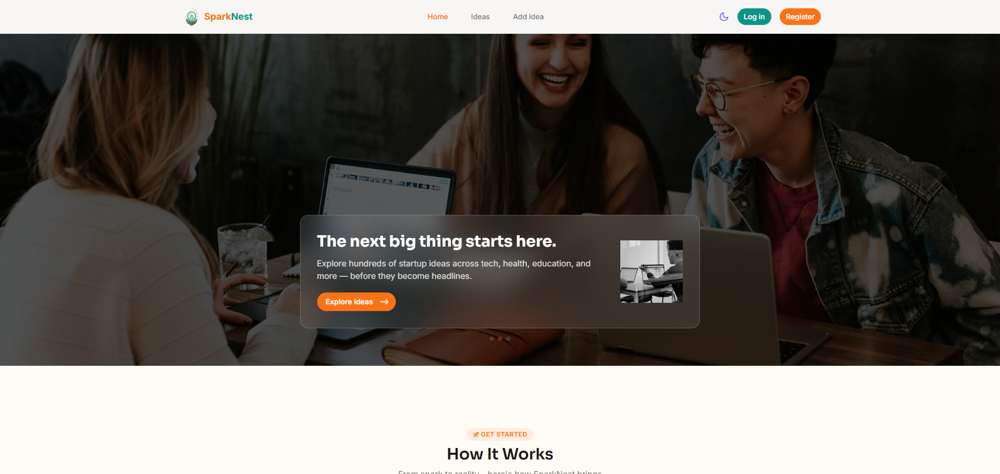
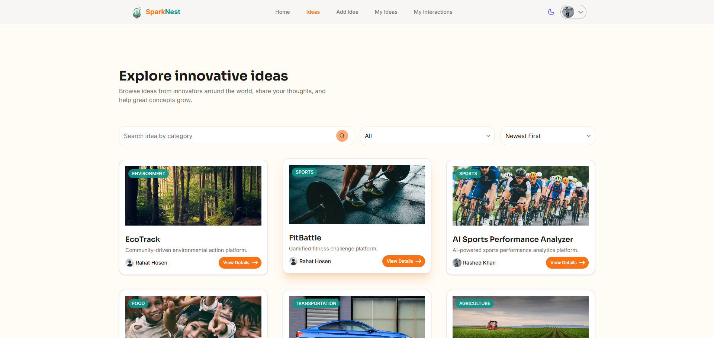
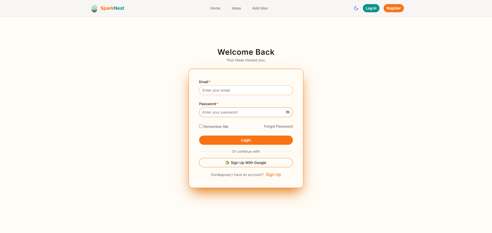
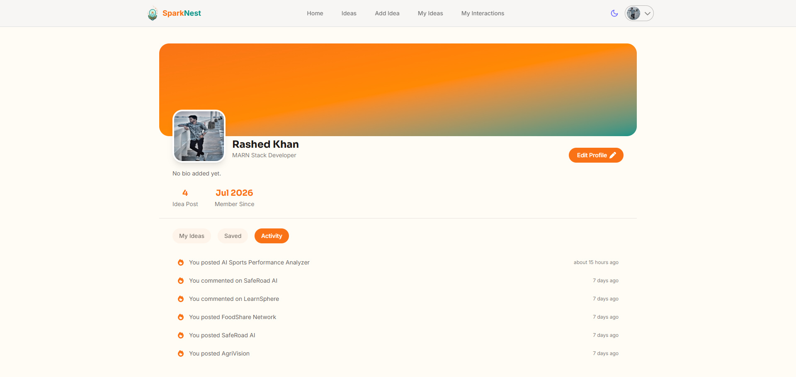

# 💡 SparkNest

> A platform to share, discover, and discuss startup ideas — built for founders, dreamers, and builders who want early feedback before writing a single line of code.

 **Live Demo:** https://ideavault-seven-beta.vercel.app/ <br/>
 **Backend Repo:** https://github.com/sabbirRashed/ideaVault-server.git

---

## ✨ Overview

SparkNest is a full-stack idea-sharing platform where users can post startup concepts, explore trending ideas, and engage through comments and interactions. Built with a modern MERN-based stack, it focuses on clean UX, theme-aware design, and a smooth authenticated experience from signup to profile management.

---

## 📸 Screenshots

| Home Page | Explore Ideas |
|-----------|----------------|
|  |  |

| Login | Profile Page |
|-------|--------------|
|  |  |


## 🚀 Features

- 🔐 **JWT-based authentication** — secure login, protected routes, and session handling via `better-auth`
- 📊 **Trending Ideas** — surfaced dynamically based on engagement
- 📝 **Post & manage ideas** — create, edit, and track your own submissions from a personal dashboard
- 💬 **Comment system** — atomic `commentCount` tracking directly on idea documents
- 👤 **Full profile system** — avatar upload, editable bio with character counter, and a profile dropdown
- 🎨 **Light / Dark / System theme toggle** — powered by a custom `useTheme` context with CSS variable–driven design tokens
- 📱 **Responsive mobile navigation** — slide-in drawer with auth-aware states (guest vs. logged-in)
- 🔍 **Search & filter** — find ideas by category, tags, or keyword
- ⚡ **Optimized UI states** — skeleton loaders, branded spinners, and empty states throughout

---

## 🛠 Tech Stack

**Frontend**
- [Next.js](https://nextjs.org/) (App Router)
- [React.js](https://react.dev/)
- [HeroUI v3](https://heroui.com/) — component library
- [Tailwind CSS v4](https://tailwindcss.com/) — CSS variable–based design system
- [Framer Motion](https://www.framer.com/motion/) — animations
- [react-icons](https://react-icons.github.io/react-icons/) (Tabler set)

**Backend**
- [Node.js](https://nodejs.org/) + [Express.js](https://expressjs.com/)
- [MongoDB](https://www.mongodb.com/)
- JWT authentication

**Fonts**
- **Sora** — headings
- **Inter** — body text

---

## 📁 Project Structure

```
sparknest/
├── src/
│   ├── app/
│   │   ├── (authentication)/     # Login & register routes
│   │   ├── add-ideas/            # Create idea flow
│   │   ├── api/                  # API route handlers
│   │   ├── ideaDetails/          # Single idea detail view
│   │   ├── ideas/                # Explore / browse all ideas
│   │   ├── my-ideas/             # User's own submitted ideas
│   │   ├── my-interactions/      # User's comments & activity
│   │   ├── profile/
│   │   │   └── edit-Profile/     # Edit profile flow
│   │   ├── page.jsx              # Home page
│   │   ├── layout.js
│   │   ├── loading.jsx
│   │   ├── not-found.jsx
│   │   ├── provider.jsx
│   │   └── globals.css
│   │
│   └── components/
│       ├── ActivityItem.jsx
│       ├── AddIdeaCard.jsx
│       ├── Banner.jsx
│       ├── CommentEditModal.jsx
│       ├── CommentSection.jsx
│       ├── DeleteCommentAlert.jsx
│       ├── DeleteIdeaAlert.jsx
│       ├── EditIdeaModal.jsx
│       ├── Footer.jsx
│       ├── IdeaCard.jsx
│       ├── LoadingSpiner.jsx
│       ├── LoginForm.jsx
│       ├── MenuDrawer.jsx
│       ├── MyIdeaCard.jsx
│       ├── MyInteractionCard.jsx
│       ├── Navbar.jsx
│       ├── ProfileDropDown.jsx
│       ├── RegisterForm.jsx
│       └── SearchFilterBar.jsx
│
├── screenshots/
├── README.md
└── package.json
```

---

## ⚙️ Getting Started

### Prerequisites
- Node.js 18+
- MongoDB (local or Atlas)

### Installation

```bash
git clone https://github.com/your-username/sparknest.git
cd sparknest
npm install
```

### Run the development server

```bash
npm run dev
```

Open [http://localhost:3000](http://localhost:3000) to view it in your browser.


---

## 🗺 Roadmap

- [ ] Notifications system
- [ ] Idea bookmarking / saving
- [ ] Public user profiles
- [ ] Email verification flow

---

## 🤝 Contributing

Contributions, issues, and feature requests are welcome.

1. Fork the project
2. Create your feature branch (`git checkout -b feature/amazing-feature`)
3. Commit your changes (`git commit -m 'Add amazing feature'`)
4. Push to the branch (`git push origin feature/amazing-feature`)
5. Open a Pull Request

---

## 👤 Author

**Sabbir Rahman**
Frontend Developer (MERN Stack)
[LinkedIn](https://www.linkedin.com/in/sabbirrahman) · [GitHub](https://github.com/sabbirRashed)